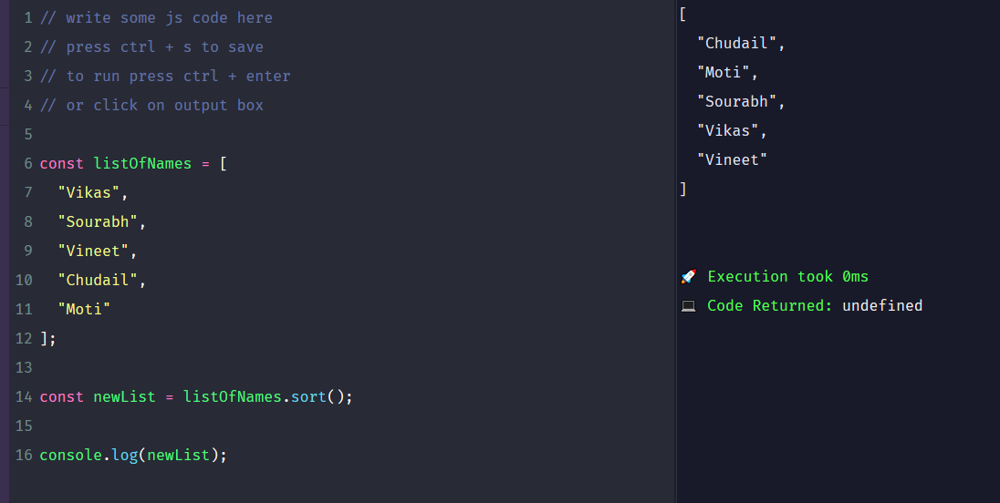

# js-playground

- An interactive javascript browser based editor and runtime 
- Can be used for testing code snippets and doing data structures and algorithms questions.

## [Check it out](https://vikas-kukreti.github.io/js-playground)

## Contribute
I am busy with my other projects, so if you want to contribute then please create a PR for the same.

### Thank you 🙏
